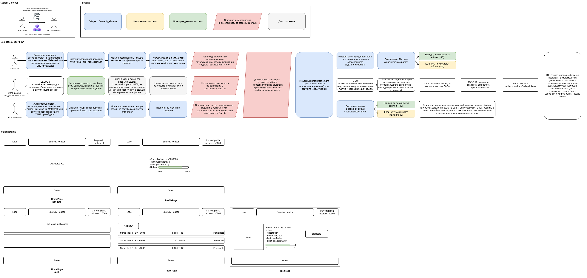
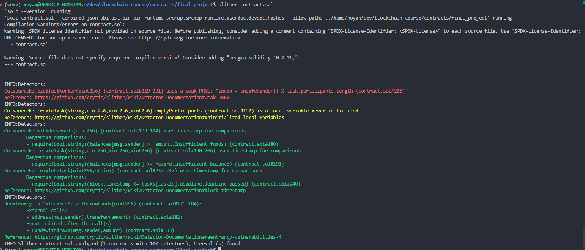

# Final project - Report
## Requirements:
- Example ideas: smart contracts, nft, secure architecture, medical and personal data security, financial systems, voting system, supply chain management, education, judicial organisation, governmental organizations, etc.
- https://moodle.astanait.edu.kz/mod/assign/view.php?id=165117

## Solution
- Topic - "Tasks and work outsourcing / crowdsourcing and DAO / Dapp in Solidity EVM"
[DAO (Decentralized Autonomous Organization)](https://en.wikipedia.org/wiki/Decentralized_autonomous_organization) - governance or management that is coordinated with delegated power of different parties. It is usually implemented for voting, ownership, tracking, crowdfunding, etc.
- Used technologies and instruments: Remix IDE / VSCode, Solidity and TBNB network, Web3JS + Vue
- Inspiration: [Yandex Toloka](https://en.wikipedia.org/wiki/Toloka), Fiverr, Upwork, etc.
- Structure of the system:
  - 
  - Source code located in contracts/final_project/
- Static code analysis of the contract with toolkit [Slither](https://github.com/crytic/slither)
  - 