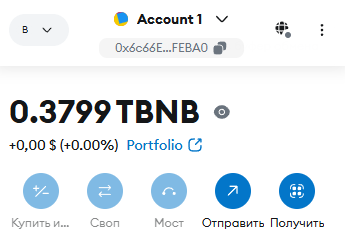
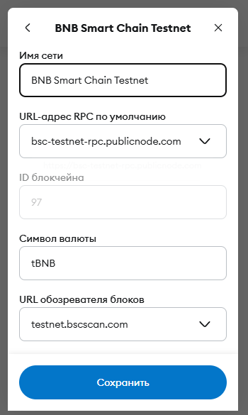
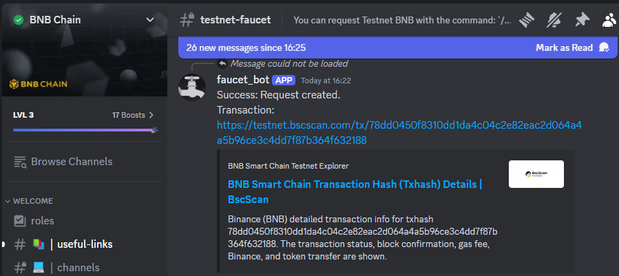

# practice 1 - Metamask and testnet

## Requirements
1. Read Whitepapers
   - http://www.ralphmerkle.com/papers/Thesis1979.pdf
   - https://evervault.com/papers/chaum
2. Create Metamask crypto wallet
   - https://metamask.io/
3. Link and connect Metamask wallet to Chainlist test blockchain network
   - https://chainlist.org
4. Receive test coins from faucet:
   - https://testnet.bnbchain.org/faucet-smart / https://www.bnbchain.org/en/testnet-faucet
   - https://faucet.quicknode.com/binance-smart-chain/bnb-testnet
   - https://faucets.chain.link/bnb-chain-testnet

## Results
1. Registered Metamask Wallet via Google Chrome Extension with address: "0x6c66E93B7042Dda62049cbbe83C6f41977bFEBA0".

2. Connected "BNB Smart Chain Testnet" as provided in Chainlist.

3. Got tBNB tokens via transcation from BNB faucet in Discord group: https://testnet.bscscan.com/tx/0x12cf76f433e7d477a1740cf768087ab134ce11735ea9bc526d4c4dbed2256684.

