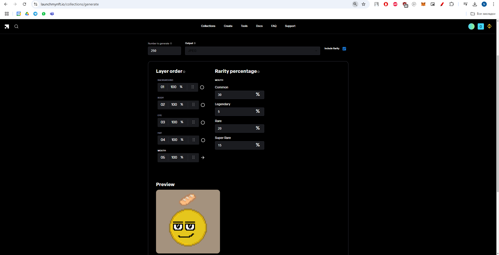

# practice 3 - Development of smart contract in solidity
## Theory
- Ethereum platform:
  - what is a smart contract?
  - how does the Ethereum blockchain work?
  - the role of test networks (e.g., Rinkeby)
- Aspects of solidity programming language: 
  - key constructs of the language (variables, functions, modifiers, events)
  - principles of working with tokens, voting systems, or lottery mechanisms.

## Requirements
1. Develop and test smart contract that implements one of the following scenarios:
   1. Voting Contract
   - Participants vote for predefined options
   - The contract automatically counts votes
   - Determine the winner based on voting results
   2. Token Management Contract
   - Create a custom token (ERC-20 standard)
   - Implement functions for transferring tokens between users
   - Provide a function to check balances
   3. Lottery Contract
   - Participants deposit funds to enter the lottery
   - The contract selects a winner randomly
   - Award the prize to the winner
2. Contract requirements:
   A. The code must be written in Solidity (version 0.8.x or later)
   B. The contract must be tested on an Ethereum test network (e.g., Rinkeby or Sepolia)
   C. Include comments in the code to explain the logic

## Solution
1. Description of the task and chosen scenario:
- Scenario - decided to implement smart contract for NFT (Non Fungible Tokens). These tokens are based on ERC-721 standard:
  1. You can mint them ("claim new token from the limited pool").
  2. Transfer to / buy from / sell (listing) to other account.
  3. Can be on different blockchains, such as eth, eth-polygon, solana, etc.
  4. Each token have unique metadata, such as URI (Uniform Resource Identifier) which is bound to some external storage (S3, IPFS, etc.). So, it could be image, video, text, or any piece of information or "art".
- Tools:
  1. Development environment - Remix IDE / VSCode Hardhat / etc.
  2. NFT collection generator - [Hashlips Art Engine Script](https://github.com/HashLips/hashlips_art_engine.git) / [LaunchMyNFT](https://www.launchmynft.io/) / etc.
  3. Metadata and file storage - IPFS and Filecoin via Pinata / NFT.Storage / Moralis / Alchemy / etc.
1. NFT creation process:
- Prepared concepts of NFT collection: "Zero2Hero" and "NiceBalls". For example, "NiceBalls" was created as pixiled art with different visual layers (background, hats, eyes, etc.).

- Generate different pseudo-random pool of NFTs with different rarity.

- Uploaded files to IPFS storage.

1. Smart contract for ERC-721 Token deployed:
  1. Contract link on the test network
  - https://opensea.io/collection/nice-balls-official
  - https://polygonscan.com/address/0x729e84350765b1d8ef812ab05889bffac9c0042c
  - https://polygonscan.com/token/0x729e84350765b1d8ef812ab05889bffac9c0042c
  - https://bscscan.com/address/0x729e84350765b1d8Ef812aB05889bFfaC9c0042c
  - https://www.launchmynft.io/collections/0xFA181175A1a317bC24B61Ad5e1675A9c9721c7BA/JCLltSwcwlpBPR5oubp
  2. Image:
  CID - bafybeidienhp6lt3ubxeyhumz4yhfomftkv57z3vblyhrpfykrkejby7uy
  IPFS URL - ipfs://bafybeidienhp6lt3ubxeyhumz4yhfomftkv57z3vblyhrpfykrkejby7uy
  Gateway URL - https://nftstorage.link/ipfs/bafybeidienhp6lt3ubxeyhumz4yhfomftkv57z3vblyhrpfykrkejby7uy
  3. JSON Metadata:
  CID - bafybeihj2qgxavln76t7pjee77espi3vaffvqk6lhcvyaezn363gnvi5zy
  IPFS URL - ipfs://bafybeihj2qgxavln76t7pjee77espi3vaffvqk6lhcvyaezn363gnvi5zy
  Gateway URL - https://nftstorage.link/ipfs/bafybeihj2qgxavln76t7pjee77espi3vaffvqk6lhcvyaezn363gnvi5zy
  4. JSON Metadata:
  CID - bafybeigkrwcoiij2n7asn3cctybzwvffq45tmxuenxyrh6wh6qz3auipri
  IPFS URL - ipfs://bafybeigkrwcoiij2n7asn3cctybzwvffq45tmxuenxyrh6wh6qz3auipri
  Gateway URL - https://nftstorage.link/ipfs/bafybeigkrwcoiij2n7asn3cctybzwvffq45tmxuenxyrh6wh6qz3auipri
  5. Hidden Image:
  CID - bafybeief44rqqtyv2qjshjiexszdrsgihnyiheby4bjihnmkikdbauows4
  IPFS URL - ipfs://bafybeief44rqqtyv2qjshjiexszdrsgihnyiheby4bjihnmkikdbauows4
  Gateway URL - https://nftstorage.link/ipfs/bafybeief44rqqtyv2qjshjiexszdrsgihnyiheby4bjihnmkikdbauows4
  6. Hidden JSON:
  CID - bafybeiajau2ryjldfyvzcr2ilabe7mwdy44afq2dk3aglnyfga4hfc6uee
  IPFS URL - ipfs://bafybeiajau2ryjldfyvzcr2ilabe7mwdy44afq2dk3aglnyfga4hfc6uee
  Gateway URL - https://nftstorage.link/ipfs/bafybeiajau2ryjldfyvzcr2ilabe7mwdy44afq2dk3aglnyfga4hfc6uee
2. Step-by-step testing process and test results with test cases for the functionality of the contract
